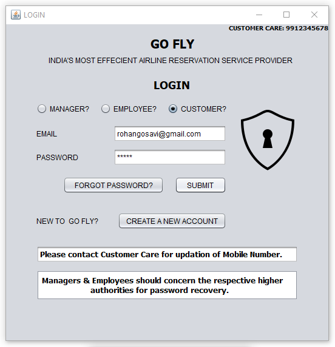
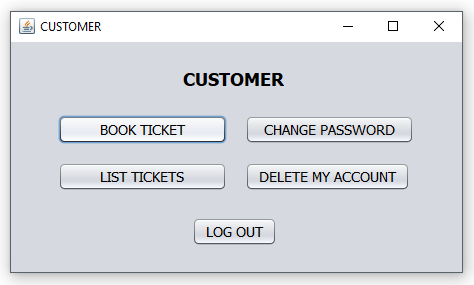
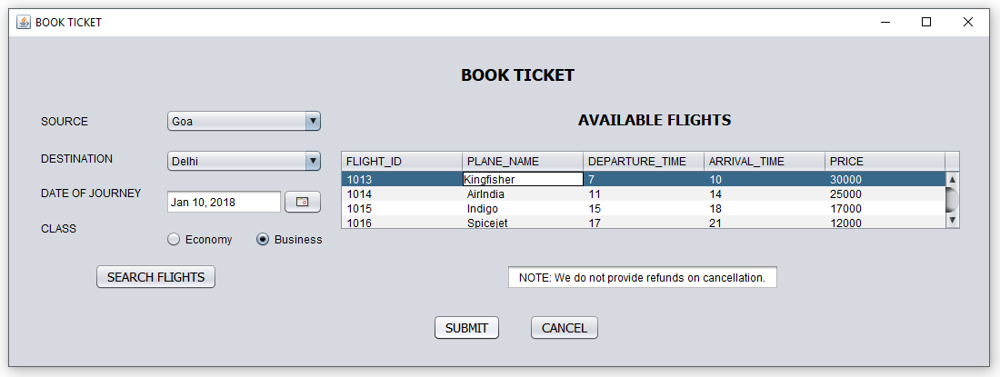
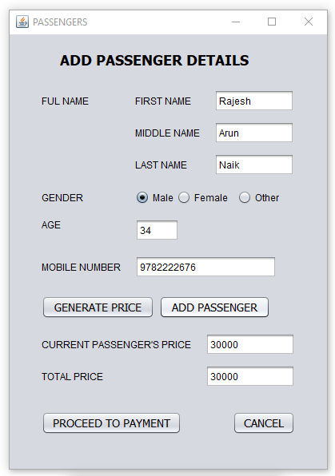
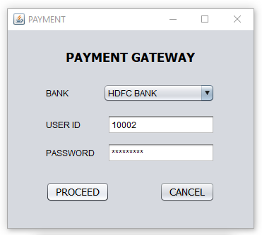
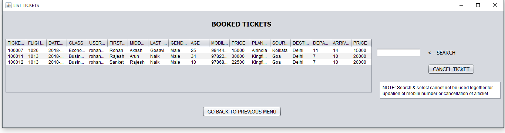

<!-- Reference:
https://github.com/othneildrew/Best-README-Template -->

<!-- PROJECT LOGO -->
 

  <h1><i> Go Fly </i></h1>

  
  .

  

    A simple Reservation System for Airlines !
  

 

<!-- TABLE OF CONTENTS -->

  
Table of Contents

  <ol>
    <li><a href="#about-the-project">About The Project</a></li>
    <li><a href="#built-with">Built With</a></li>
    <li><a href="#getting-started">Getting Started</a></li>
    <li><a href="#some-screenshots">Some Screenshots</a></li>
    <li><a href="#license-or-author">License or Author</a></li>
    <li><a href="#contact">Contact</a></li>
    <li><a href="#acknowledgments">Acknowledgments</a></li>
  </ol>

 

<!-- ABOUT THE PROJECT -->
## About The Project
  Created an easy to use online reservation system for airlines; with added payment and customer support.

  
(<a href="#readme-top">back to top</a>)

## Built With
  &nbsp; &nbsp; &nbsp; &nbsp; &nbsp; &nbsp;  &nbsp; &nbsp; &nbsp; &nbsp; &nbsp; &nbsp; &nbsp; &nbsp; 
  
  &nbsp;  &nbsp; &nbsp; &nbsp; &nbsp; &nbsp; &nbsp; &nbsp; &nbsp; <b><i> Java </i></b> &nbsp; &nbsp; &nbsp; &nbsp; &nbsp; &nbsp; &nbsp; &nbsp; &nbsp; &nbsp; &nbsp; &nbsp; &nbsp; <b><i> Oracle DB </i></b>

  
(<a href="#readme-top">back to top</a>)

<!-- GETTING STARTED -->
## Getting Started
  #### Prerequisites
  * Java, JDK, JRE
  * Oracle 10g XE Database
  * IDE - Netbeans (Preferred)
  * Machine Requirements: Minimum 4GB RAM, Intel i5 Processor (or Equivalent)
  
  #### Setup and Use
  1. ###### Set Up Database
       1. Download, install and set-up Oracle 10g XE.
       2. Create and set-up a new Database.
       3. Create the required tables and add the necessary data, using the queries provided in <b>'/Main Project/Oracle Database/Airline Reservation System.txt'</b>
       4. Copy DB credentials.

  2. ###### Set Up & Run the Application
       1. Get the application source code from <b>'/Main Project/NetBeans - Java Project/Airline Reservation System/'</b>.
       2. Import the source folder to IDE.
       3. Add all the JAR files provided in <b>'/Requirements/'</b> folder - to the project.
       4. Update the database credentials in all applicable files (as per the new DB credentials set-up in Step-1).
       5. Build and run the application using IDE's built-in features.

  
(<a href="#readme-top">back to top</a>)

  
<!-- SOME SCREENSHOTS -->
## Some Screenshots
  

     &nbsp; &nbsp; 
     
    
     
     &nbsp; &nbsp; 
     
    
  

  
(<a href="#readme-top">back to top</a>)

   

<!-- LICENSE -->
## License or Author
  * Uditya Laad, Goa College of Engineering, Goa University, GA, IN

  
(<a href="#readme-top">back to top</a>)

<!-- CONTACT -->
## Contact
  <b>Uditya Laad</b> &nbsp; [@linkedin.com/in/uditya-laad-222680148](https://www.linkedin.com/in/uditya-laad-222680148/)
  
  &nbsp; &nbsp; &nbsp; &nbsp; &nbsp; &nbsp; &nbsp; &nbsp; &nbsp; &nbsp; &nbsp; [@github.com/udityalaad](https://github.com/udityalaad)
  
  &nbsp; &nbsp; &nbsp; &nbsp; &nbsp; &nbsp; &nbsp; &nbsp; &nbsp; &nbsp; &nbsp; udityalaad123@gmail.com

  <b>Project Link</b> &nbsp; [https://github.com/udityalaad/Go_Fly](https://github.com/udityalaad/Go_Fly)

  
(<a href="#readme-top">back to top</a>)

<!-- ACKNOWLEDGMENTS -->
## Acknowledgments
  * [github.com/othneildrew/Best-README-Template/](https://github.com/othneildrew/Best-README-Template)
  * [Airplane Wallpapers](https://wallpaperfordesktop.com/airplane-wallpapers/)
  
  
(<a href="#readme-top">back to top</a>)

